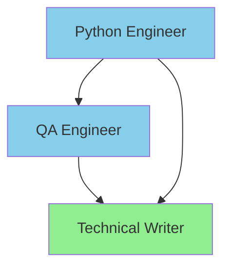

# Global Claude Code Agent Delegation System

**Generated**: 2025-10-05 18:18:16
**Source**: 3 specialized agents
**Version**: 4.0 - Orchestration-Aware Delegation

⚠️ **AUTO-GENERATED** - Do not edit manually

---

## 🎯 Agent Detection Matrix

| **Pattern** | **Agent** | **Enforcement** |
|-------------|-----------|----------------|

---

## 🔄 Coordination Workflows

### Web Application Development:
```
python-engineer → qa-engineer → technical-writer```

---

## 📊 Coordination Graph



**Statistics:**
- Total Agents: 3
- Entry Points: 0
- Cached Paths: 3
- Optimization Time: 0.06ms

---

## Agent Directory

### Tier 1: Efficiency Agents (Haiku)

**technical-writer** `model: haiku`
- Documentation specialist creating clear, comprehensive technical documentation

### Tier 2: Specialist Agents (Sonnet)

**python-engineer** `model: sonnet`
- Expert Python developer specializing in web frameworks and data processing
- Coordinates with: qa-engineer, technical-writer

**qa-engineer** `model: sonnet`
- Quality assurance specialist focused on test automation and comprehensive testing strategies
- Coordinates with: technical-writer


---

## 💰 Cost Optimization

**Tier 1 (Haiku):** `technical-writer`
**Tier 2 (Sonnet):** `qa-engineer`, `python-engineer`
**Tier 3 (Opus):** 
---

*Generated by claude-config v4.0*